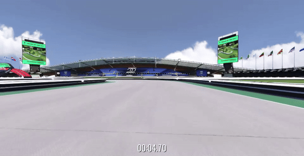

# Autonomous Racing with Reinforcement Learning

By [Anisha Bhatnagar](https://github.com/anishabhatnagar) and [Ashwin Kumar Udayakumar](https://github.com/ashwin2k)

All of the code for this project is available at [https://github.com/ashwin2k/tmrl-rnn](https://github.com/ashwin2k/tmrl-rnn)

The presentation for this project is available at [https://docs.google.com/presentation/d/1o_5flckV6MKzOfUubradi3Pf11HMKu0q5wjviKZX-I8/edit?usp=sharing](https://docs.google.com/presentation/d/1o_5flckV6MKzOfUubradi3Pf11HMKu0q5wjviKZX-I8/edit?usp=sharing)

The demo videos are available here [https://drive.google.com/drive/folders/1uhuof75dGtL4r3zqn8PkkF2Jo3kGyMk3?usp=drive_link](https://drive.google.com/drive/folders/1uhuof75dGtL4r3zqn8PkkF2Jo3kGyMk3?usp=drive_link)

## **Introduction**
### 1. **Overview of Trackmania**

Trackmania(2020) is a renowned racing game that offers a blend of high-speed driving and intricate track design. The application of Reinforcement Learning (RL) to Trackmania allows for the exploration of AI-driven optimization in a complex, interactive environment. Using the TMRL framework, developers can implement deep reinforcement learning strategies to train agents that navigate the game’s challenging tracks. This framework supports real-time learning, which is critical for adapting to the dynamic conditions of Trackmania’s gameplay.

**Observations and Actions:**

- **Observations**: Include images, speed, telemetry data, and the norm of velocity. Various observation spaces are available, such as raw screenshots or LIDAR measurements.
- **Actions**: The AI can control the car using analog inputs emulating an Xbox360 controller or through binary arrow presses to control gas, brake, steering angle etc.

**Reward Function:**

Inspired by behaviorism, the environment provides a reward at each time-step as a measure of performance. Instead of merely rewarding speed, the reward function assesses how effectively the car covers the track. A demonstration trajectory is recorded and divided into points, with rewards given based on the number of points passed since the last time-step. This measures the car’s effectiveness in covering significant portions of the track efficiently.

**Environments**
For this project, we have used three different customizable gym environments -

**I. LIDAR Environment:**

Offers simplified input with **19-beam LIDAR measurements**, ideal for MLP models. Optimized for tracks with clear demarcations, it uses a front camera setup with the car model hidden, focusing on environmental data. Features include:

- **Simplified Visual Inputs**: Focuses on spatial awareness and immediate reactions.
- **Configurable Interface:** Customizable window dimensions, reset sleep time, and data history length for real-time responsiveness.

**II. LIDAR with Track Progress Environment:**

This enhanced LIDAR environment includes additional track completion data, enhancing predictive capabilities similar to experienced human players. It is structured as follows:

- **Observation Details:** Supports a four-measurement LIDAR history, adjustable for RNNs.
- **Real-Time Configuration**: Features 0.05-second time steps and captures action history over two steps.

**III. Hybrid Environment:**
Using pure vision-based models in autonomous racing like TrackMania presents significant challenges, especially in detecting and understanding crashes. These models often struggle because the TrackMania API does not provide specific data when a car crashes against walls, leading to scenarios where the car frequently hugs the wall without proper corrective actions.

Conversely, operating without vision-based systems also has its limitations. For example, non-visual systems fail to capture detailed nuances about the track, which are crucial in complex environments such as those with a street racing theme. These environments require detailed information about the track and obstacles, which pure non-visual models cannot provide adequately. Thus, both pure vision and non-vision approaches have critical gaps that can affect performance in dynamic racing scenarios.

To bridge these gaps, we created a special environment that provides extensive data inputs like **screenshots and telemetry data (speed, gear, RPM) and LIDAR measurements**, suitable for training with CNNs. It supports all Trackmania tracks and various camera settings, offering a flexible and robust platform. Features include:

- **Image Processing**: Supports up to four-frame image history, available in grayscale or color.
- **Temporal Settings**: Time steps of 0.05 seconds, with adjustable action history and episode lengths.

The Goal of this environment is to imbue more data to the computer vision models. These models are not able to successfully detect crashes, therefore often restart the lap during training and lead to lower rewards. Adding LIDAR information will aid the model in knowing the exact distances from the track edges thereby reducing the collisions. However, this environment is extremely complex owing to the high number of observations being extracted from each state.

### 2. **Soft Actor-Critic (SAC) Algorithm Overview**

The Soft Actor-Critic (SAC) algorithm is highly effective for environments requiring continuous action decisions, such as the dynamic and complex world of F-1 racing games like Trackmania. As a model-free, off-policy algorithm, SAC optimizes a policy that balances the dual objectives of maximizing expected return and entropy. This entropy augmentation promotes exploration by valuing uncertain states, which helps prevent premature convergence on suboptimal strategies.

**Key Features of SAC:**

- **Entropy-Augmented Reward:** SAC's integration of entropy encourages exploration, enhancing the policy's adaptability and effectiveness in complex environments.
- **Stability and Efficiency:** SAC features soft policy updates, which improve stability and reduce sensitivity to hyperparameter settings, making it suitable for real-time applications where decisions must be rapid and reliable.
- **Optimal for Continuous Action Spaces**: Trackmania's continuous control demands, such as steering angles and throttle management, are well-suited for SAC because it can directly derive optimal actions from continuous sets.

## **Experiment 1: RNN Integration and Transition to LIDAR**

**Architectural Changes and Setup:**

In the development of autonomous driving models for racing scenarios like TrackMania, integrating standard LIDAR inputs has proven crucial. These inputs provide precise distance measurements, which have significantly reduced crash occurrences by enhancing the model’s understanding of its surroundings. However, these measurements are not enough as the model may not be able to remember collisions from previous time steps at the time of decision making. Therefore, we have used these measurements with a policy network made of Gated Recurrent Units (GRU) (2 layers) with Multilayer Perceptrons (MLP) (2 layers). GRU was added to augment the model’s temporal processing capabilities. This enhancement enables the model to effectively recall and utilize past driving decisions and outcomes during decision-making processes. As a result, the model can quickly recover from crashes, showcasing improved resilience and efficiency in handling the dynamic challenges presented by racing environments.

**Performance and Outcomes:**

- **Training Efficiency:** Training speed tripled, facilitating deeper learning within the same timeframe.
- **Reduction in Collisions:** The RNN’s memory significantly decreased collision frequency, improving track navigation and turn maneuvering.
- **Track Completion:** The AI completed the entire track with lap times around **45-50 seconds**, while human performance is around 30 seconds - a substantial improvement over the first experiment.

This experiment highlighted the effectiveness of RNNs in managing temporal dynamics within racing games. By integrating RNNs with LIDAR inputs, we streamlined the training process and significantly enhanced performance, indicating a robust approach for tasks that require both memory and real-time processing capabilities. The integration led to a notable reduction in crashes. Additionally, unlike the EffNet_v2 model, this setup allowed the agent to effectively navigate and recover from the crashes and successfully complete the lap. However, despite the good results, the model struggled with understanding the tradeoff between collisions and speed. In certain scenarios, the model would speed up but suffer from higher collisions. At the same time, in another scenario, the model had zero collisions but was extremely slow. Another problem with this setup was that the model was not able to predict ahead of time which direction it would need to turn. In these cases it would collide with the track edge before correcting its trajectory.

## **Experiment 2: LIDAR with Track Progress Environment**

**Architectural Setup and Environmental Changes**:

Continuing from previous successes, Experiment 3 used the same RNN architecture but added the LIDAR with Track Progress environment. This enhancement included a track completion metric, providing the model with information about the upcoming turns and track sections in advance thereby, helping the model adjust its actions based on impending track conditions.

**Performance and Outcomes:**

- **Rapid Training Progress:** The model trained significantly faster, demonstrating substantial early progress by effectively anticipating upcoming track sections.
- **Early Achievements in Training:** By the fifth epoch, the model was navigating past the first turn and reaching the second, a stark improvement over earlier models that struggled at this stage.
- **Improved Lap Times:** Achieving a lap time of 35 seconds marked a major advancement, illustrating the effectiveness of integrating track progress data.

This experiment highlighted the benefits of adding contextual and predictive data to AI training in racing games. By simulating foresight with track progress data, the model adopted a strategic and anticipatory driving style similar to experienced human players. These results indicate that such enhancements can significantly improve training efficiency and effectiveness, setting the stage for advanced AI capabilities in simulated environments.

## **Experiment 3: EfficientNet_v2 in Hybrid Environment**

**Architecture and Training:**

This experiment utilized EfficientNet_v2 followed by two MLP layers with ReLU activation. This architecture was tasked with encoding images from Trackmania and integrating these with other sensory data and LIDAR measurements to control the vehicle. The combined inputs processed through the MLP layers aimed to generate appropriate action outputs.

**Performance Observations:**

The model showed gradual learning improvements, indicated by reducing actor and critic losses. However, challenges included:

- **Behavioral Tendencies**: The vehicle frequently hugged the track edges, suggesting limited situational awareness, possibly due to the convolutional network's lack of memory for recent incidents and spatial awareness.
- **Training Speed**: Progress was slow, constrained by the high computational demands of EfficientNet_v2 and the operational requirement for the rollout worker to continuously run in the foreground, interacting directly with the game's active user interface.

Despite these issues, the experiment revealed potential for significant improvements with extended training. This model is currently still in training. Right now, the model is only able to move forward by hugging the walls.

## **Results and Discussion Summary**

**Experiment 1 (RNN with LIDAR):** Addressed temporal issues with RNN integration, reducing collisions and enhancing track navigation. The shift to a LIDAR environment decreased computational demands and improved training speed, resulting in the model completing the track with a lap time of about 45 seconds.

**Experiment 2 (LIDAR with Track Progress):** Achieved the best results, with a lap time of 35 seconds. Incorporating track progress data enabled the model to anticipate the track layout, significantly boosting performance early in training.

**Experiment 3 (EffNet in Full Environment):** Demonstrated efficientnet_v2's potential with complex visuals but was limited by slow training and the model's tendency to hug track edges.

## **Conclusion**

Each experiment provided valuable insights into AI-driven racing strategies, culminating in the successful use of track progress data with an RNN to achieve a lap time of 30 seconds. Furthermore, RNN greatly reduced the training time. RNN with LIDAR track progress trained in 1/3rd the time of RNN with just LIDAR. This approach demonstrated the potential of incorporating contextual awareness into AI systems, significantly enhancing decision-making capabilities..The outcomes indicate promising strategies for refining autonomous systems, particularly through the development of predictive navigation capabilities essential in autonomous vehicles. Further research could explore more sophisticated neural network architectures, such as Transformers, to capture spatial-temporal dynamics more effectively. Hybrid models combining CNNs and RNNs might also improve performance. The training process would also benefit from a full-scale hyperparameter search and extensive training to explore AI’s capabilities in high-speed racing environments more deeply.

